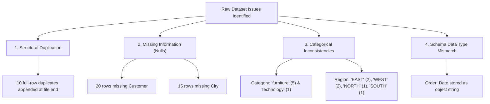

# Phase 1: Data Understanding & Initial Inspection Report

**Project**: Retail Sales & Profitability Analysis (Data Analyst Portfolio Project)  
**Dataset**: `sales_analysis_raw.csv`  
**Phase**: Step 01 — Data Understanding & Exploratory Inspection  
**Status**: Completed (Raw Data Preserved Intact)  
**Script Equivalent**: [`python/01_data_understanding.py`](file:///d:/Gravity%20Projects/python/01_data_understanding.py)  

---

## Executive Summary

Before performing any transformations, cleaning, or dashboard development, a rigorous **Data Understanding & Inspection Step** was executed on the raw dataset `sales_analysis_raw.csv`. 

This step establishes baseline metrics, maps the schema, audits missingness and duplicates, validates logical business rules, and uncovers underlying data quality issues. In accordance with analytical best practices:
- **Zero data cleaning was performed during this stage.**
- **The original CSV file has not been altered, modified, or overwritten.**
- **All findings presented below are direct empirical observations from the raw data.**

---

## 1. Dataset Dimensions & Scale

| Metric | Value | Description |
| :--- | :--- | :--- |
| **Total Rows (Observations)** | **5,010** | Individual line-item sales transactions |
| **Total Columns (Features)** | **11** | Transactional, customer, geographic, and financial attributes |
| **Total Data Points (Cells)** | **55,110** | 5,010 rows × 11 columns |
| **Raw File Size** | **~446.8 KB** | Comma-Separated Values (`.csv`) text format |
| **Unique Orders Identified** | **5,000** | 10 records are exact duplicates appended at the file end |

---

## 2. Column Inventory & Data Dictionary

The raw dataset contains 11 columns capturing standard retail e-commerce transactions:

| # | Column Name | Raw Pandas Type | Logical Type | Description | Sample Raw Value |
| :-: | :--- | :--- | :--- | :--- | :--- |
| 1 | `Order_ID` | `object` (string) | Unique Identifier | Alphanumeric transaction identifier | `ORD00001` |
| 2 | `Order_Date` | `object` (string) | Date | Date when the purchase was made | `2025-04-13` |
| 3 | `Customer` | `object` (string) | Categorical / Text | Full name of the purchasing customer | `Aarav Rathod` |
| 4 | `Category` | `object` (string) | Categorical (Nominal) | High-level product department | `Office Supplies` |
| 5 | `Product` | `object` (string) | Categorical (Nominal) | Specific merchandise item sold | `Calculator` |
| 6 | `Region` | `object` (string) | Categorical (Nominal) | Geographic zone in India | `South` |
| 7 | `City` | `object` (string) | Categorical (Nominal) | City where order was delivered | `Hyderabad` |
| 8 | `Quantity` | `int64` (integer) | Quantitative (Discrete) | Number of units purchased | `3` |
| 9 | `Discount` | `float64` (float) | Quantitative (Continuous) | Promotional discount rate (0.0 to 0.30) | `0.05` |
| 10 | `Sales` | `float64` (float) | Quantitative (Continuous) | Total gross revenue in INR (₹) | `1899.23` |
| 11 | `Profit` | `float64` (float) | Quantitative (Continuous) | Net profit realized in INR (₹) | `364.51` |

---

## 3. Data Types: Raw vs. Recommended

In pandas, string and mixed columns default to `object` (or `string`). For downstream statistical analysis, modeling, and dashboarding, several columns require type casting in the upcoming cleaning stage:

| Column Name | Current Raw Dtype | Recommended Target Dtype | Justification & Interview Rationale |
| :--- | :--- | :--- | :--- |
| `Order_ID` | `object` | `string` | Alphanumeric code; string avoids accidental numeric conversions. |
| `Order_Date` | `object` | `datetime64[ns]` | Currently plain text; converting unlocks date filtering, month/quarter grouping, and time-series aggregations. |
| `Customer` | `object` | `string` | High-cardinality text column. |
| `Category` | `object` | `category` | Low cardinality (3 unique departments); category saves memory and accelerates group-by operations. |
| `Product` | `object` | `category` | 14 fixed products; ideal for category dtype. |
| `Region` | `object` | `category` | 4 geographic zones; category dtype. |
| `City` | `object` | `category` / `string` | 16 tier-1 and tier-2 Indian cities. |
| `Quantity` | `int64` | `int16` / `int64` | Integer values ranging from 1 to 10. |
| `Discount` | `float64` | `float64` | Fractional rate ranging from 0.00 to 0.30. |
| `Sales` | `float64` | `float64` | Monetary transaction amount with 2 decimal precision. |
| `Profit` | `float64` | `float64` | Monetary profit amount with 2 decimal precision. |

---

## 4 & 5. Missing Values Audit (Count & Percentage)

An audit of null and empty values across all 5,010 rows revealed **35 total missing cells** across 2 specific columns. The overall completeness rate of the dataset is **99.94%**.

| Column Name | Total Rows | Non-Null Count | Missing Count | Missing Percentage | Severity Assessment |
| :--- | :-: | :-: | :-: | :-: | :--- |
| `Order_ID` | 5,010 | 5,010 | **0** | **0.00%** | None (Primary key complete) |
| `Order_Date` | 5,010 | 5,010 | **0** | **0.00%** | None (Timeline complete) |
| `Customer` | 5,010 | 4,990 | **20** | **0.40%** | Low (20 transactions lack customer name) |
| `Category` | 5,010 | 5,010 | **0** | **0.00%** | None |
| `Product` | 5,010 | 5,010 | **0** | **0.00%** | None |
| `Region` | 5,010 | 5,010 | **0** | **0.00%** | None |
| `City` | 5,010 | 4,995 | **15** | **0.30%** | Low (15 transactions lack city name) |
| `Quantity` | 5,010 | 5,010 | **0** | **0.00%** | None |
| `Discount` | 5,010 | 5,010 | **0** | **0.00%** | None |
| `Sales` | 5,010 | 5,010 | **0** | **0.00%** | None |
| `Profit` | 5,010 | 5,010 | **0** | **0.00%** | None |

### Key Observations on Missing Data:
1. **No Overlapping Nulls**: There are **0 rows** where both `Customer` and `City` are missing simultaneously. Exactly 35 distinct rows contain one missing field.
2. **Missing `Customer` (20 rows)**: Examples include `ORD00213`, `ORD00216`, `ORD00227`, `ORD00527`, and `ORD00623`. All financial and product data for these orders are intact.
3. **Missing `City` (15 rows)**: Examples include `ORD00039`, `ORD01436`, `ORD01502`, and `ORD01649`. In all 15 cases, the `Region` is populated (e.g., North, West, South, East), but the specific city within that region was left blank.

---

## 6. Duplicate Rows Analysis

A deduplication check was performed using pandas:
```python
exact_duplicates = df.duplicated().sum()
order_id_duplicates = df["Order_ID"].duplicated().sum()
```

- **Exact Duplicate Rows**: **10 rows** (0.20% of the dataset).
- **Duplicate `Order_ID` Values**: **10 rows**.
- **True Unique Records**: Exactly **5,000 unique transactions**.

### Breakdown of the 10 Duplicated Rows

The 10 duplicate rows are exact identical copies appended at the very end of the raw CSV file (rows 5000 to 5009 in zero-indexed pandas DataFrame):

| Duplicate Row Index | Order_ID | Order_Date | Customer | Category | Product | Region | City | Quantity | Discount | Sales (₹) | Profit (₹) | Original Row Index |
| :-: | :--- | :--- | :--- | :--- | :--- | :--- | :--- | :-: | :-: | :-: | :-: | :-: |
| 5000 | `ORD03407` | 2025-02-06 | Isha Sharma | Office Supplies | File Folder | West | Ahmedabad | 2 | 0.05 | 228.53 | 67.47 | 3406 |
| 5001 | `ORD00758` | 2025-06-12 | Meera Singh | Furniture | Office Chair | North | Delhi | 8 | 0.05 | 56943.49 | 12278.36 | 757 |
| 5002 | `ORD03625` | 2025-11-05 | Pooja Mehta | Furniture | Desk | South | Kochi | 4 | 0.05 | 42571.04 | 6145.90 | 3624 |
| 5003 | `ORD04545` | 2025-07-29 | Ananya Kumar | Office Supplies | Pen Set | West | Rajkot | 4 | 0.10 | 862.88 | 285.44 | 4544 |
| 5004 | `ORD03236` | 2025-04-20 | Rohan Singh | Technology | Keyboard | West | Rajkot | 1 | 0.10 | 1548.12 | 384.04 | 3235 |
| 5005 | `ORD01869` | 2025-03-15 | Sneha Joshi | Office Supplies | Stapler | East | Guwahati | 1 | 0.15 | 296.55 | 61.53 | 1868 |
| 5006 | `ORD02917` | 2025-07-15 | Priya Rathod | Technology | Keyboard | East | Patna | 2 | 0.00 | 3534.67 | 727.12 | 2916 |
| 5007 | `ORD03336` | 2025-10-29 | Vivek Shah | Office Supplies | Calculator | South | Chennai | 6 | 0.10 | 3575.36 | 718.54 | 3335 |
| 5008 | `ORD03528` | 2025-03-28 | Pooja Joshi | Technology | Keyboard | South | Bengaluru | 2 | 0.15 | 3075.56 | 630.67 | 3527 |
| 5009 | `ORD02828` | 2025-04-09 | Riya Joshi | Office Supplies | Pen Set | North | Delhi | 10 | 0.10 | 2140.18 | 553.56 | 2827 |

*Impact Assessment*: In step 2 (Data Cleaning), dropping these 10 exact duplicate rows will preserve analytical integrity and eliminate revenue double-counting of ₹171,192.48.

---

## 7. Categorical Columns Deep-Dive

### A. Customer Column
- **Non-null Unique Customers**: **192 unique names** (193 including `NaN`).
- **Customer Frequency Distribution**:
  - Highest order count: Meera Singh (38 orders), Vivek Patel (37), Ananya Verma (37), Sneha Desai (37).
  - Lowest order count: Jay Joshi (13 orders), Rahul Kapoor (13).
  - Average orders per customer: ~26.0 orders.
- **Geographic Behavior**: Customers are not localized to a single city. Each customer orders across an average of **12.6 distinct cities** throughout India.

### B. Category Column
- **Raw Unique Count**: **5 values** (`Technology`, `Office Supplies`, `Furniture`, `furniture`, `technology`).
- **True Semantic Categories**: **3 departments** (Technology, Office Supplies, Furniture).
- **Frequency Distribution**:

| Category (Raw Value) | Order Count | Percentage | Data Quality Status |
| :--- | :-: | :-: | :--- |
| `Technology` | 1,892 | 37.76% | Standard Title Case |
| `Office Supplies` | 1,781 | 35.55% | Standard Title Case |
| `Furniture` | 1,331 | 26.57% | Standard Title Case |
| `furniture` | 5 | 0.10% | **Non-standard lowercase** |
| `technology` | 1 | 0.02% | **Non-standard lowercase** |
| **Total** | **5,010** | **100.00%** | Standardized breakdown: Tech 37.78%, Office 35.55%, Furn 26.67% |

### C. Product Column
- **Raw Unique Count**: **14 products** (100% clean casing, zero typos or whitespace anomalies).
- **Hierarchy Mapping**:

| Department (Category) | Products Included | Product Order Counts | Total Dept Orders |
| :--- | :--- | :--- | :-: |
| **Technology** | Printer, Mouse, Monitor, Keyboard, Laptop | Printer (405), Mouse (390), Monitor (380), Keyboard (364), Laptop (354) | 1,893 |
| **Office Supplies** | File Folder, Pen Set, Stapler, Calculator, Notebook | File Folder (379), Pen Set (376), Stapler (350), Calculator (343), Notebook (333) | 1,781 |
| **Furniture** | Bookshelf, Desk, Conference Table, Office Chair | Bookshelf (347), Desk (341), Conference Table (339), Office Chair (309) | 1,336 |

### D. Region Column
- **Raw Unique Count**: **8 values** (`West`, `South`, `North`, `East`, `EAST`, `WEST`, `NORTH`, `SOUTH`).
- **True Semantic Regions**: **4 geographic zones** (West, South, North, East).
- **Frequency Distribution**:

| Region (Raw Value) | Order Count | Percentage | Data Quality Status |
| :--- | :-: | :-: | :--- |
| `West` | 1,592 | 31.78% | Standard Title Case |
| `South` | 1,239 | 24.73% | Standard Title Case |
| `North` | 1,210 | 24.15% | Standard Title Case |
| `East` | 963 | 19.22% | Standard Title Case |
| `EAST` | 2 | 0.04% | **Non-standard uppercase** |
| `WEST` | 2 | 0.04% | **Non-standard uppercase** |
| `NORTH` | 1 | 0.02% | **Non-standard uppercase** |
| `SOUTH` | 1 | 0.02% | **Non-standard uppercase** |
| **Total** | **5,010** | **100.00%** | Standardized: West (31.82%), South (24.75%), North (24.17%), East (19.26%) |

### E. City Column
- **Raw Unique Count**: **16 unique non-null cities** (17 including `NaN`).
- **Cross-Regional Integrity**: Each city strictly maps to exactly **one** geographical region (100% consistent 1-to-1 mapping):

| Region | Cities Represented | Orders per City | Region Total |
| :--- | :--- | :--- | :-: |
| **West** | Vadodara (417), Surat (406), Rajkot (402), Ahmedabad (367) | 4 cities | 1,592 (standard) + 2 (`WEST`) = 1,594 |
| **South** | Hyderabad (332), Chennai (309), Bengaluru (308), Kochi (287) | 4 cities | 1,239 (standard) + 1 (`SOUTH`) = 1,240 |
| **North** | Delhi (323), Lucknow (298), Jaipur (293), Chandigarh (291) | 4 cities | 1,210 (standard) + 1 (`NORTH`) = 1,211 |
| **East** | Kolkata (251), Patna (246), Guwahati (245), Bhubaneswar (220) | 4 cities | 963 (standard) + 2 (`EAST`) = 965 |
| **Missing** | `NaN` (15 orders with unrecorded city) | — | 15 |

---

## 8. Summary Statistics for Numeric Columns

The dataset contains four continuous/discrete quantitative columns. Parametric (Mean, Std Dev) and non-parametric (Median, IQR) statistics are detailed below:

| Metric | Quantity (Units) | Discount (Rate) | Sales (INR ₹) | Profit (INR ₹) | Profit Margin (%) |
| :--- | :-: | :-: | :-: | :-: | :-: |
| **Count** | 5,010 | 5,010 | 5,010 | 5,010 | 5,010 |
| **Minimum** | **1.00** | **0.00** (0%) | **₹81.42** | **₹15.95** | **4.61%** |
| **25th Percentile (Q1)** | 1.00 | 0.00 (0%) | ₹844.64 | ₹211.71 | 13.55% |
| **Median (50% / Q2)** | **2.00** | **0.10** (10%) | **₹6,378.46** | **₹1,078.43** | **18.51%** |
| **Mean** | **3.13** | **0.0863** (8.63%) | **₹27,357.12** | **₹3,553.22** | **18.89%** |
| **75th Percentile (Q3)** | 4.00 | 0.15 (15%) | ₹32,238.13 | ₹4,291.60 | 24.22% |
| **Maximum** | **10.00** | **0.30** (30%) | **₹512,064.81** | **₹65,734.45** | **34.98%** |
| **Standard Deviation** | 2.24 | 0.0755 | ₹51,281.98 | ₹6,322.25 | 6.61% |
| **Interquartile Range (IQR)**| 3.00 | 0.15 (15%) | ₹31,393.49 | ₹4,079.89 | 10.67% |

### Statistical Insights for Interview Context:
- **Right-Skewed Distribution in Sales & Profit**: 
  - Mean Sales (₹27,357) is over **4.2x higher** than Median Sales (₹6,378).
  - Mean Profit (₹3,553) is over **3.2x higher** than Median Profit (₹1,078).
  - *Business Rationale*: High-ticket equipment such as Laptops and Conference Tables inflate the mean, while low-cost office supplies (Staplers, Folders) form the high-volume base. Median is the more robust measure of central tendency here.
- **Quantity Patterns**: Discrete values only take values `[1, 2, 3, 4, 5, 6, 8, 10]`. Values `7` and `9` do not appear, indicating standard multi-pack commercial bundling.
- **Discount Tiers**: Discounts are strictly tiered into 6 discrete brackets: `0.00`, `0.05`, `0.10`, `0.15`, `0.20`, and `0.30`. No arbitrary decimal discounts exist.

---

## 9. Date Range & Temporal Coverage

| Temporal Metric | Observed Value | Description |
| :--- | :--- | :--- |
| **Earliest Order Date (Min)** | **2025-01-01** | Wednesday, January 1, 2025 |
| **Latest Order Date (Max)** | **2025-12-31** | Wednesday, December 31, 2025 |
| **Total Calendar Span** | **365 Days** | Exactly one full Gregorian calendar year |
| **Unique Dates with Orders** | **365 Days** | Zero days with zero sales; continuous daily operation |
| **Failed Date Conversions** | **0** | 100% of date strings conform to ISO-8601 `YYYY-MM-DD` |

### Monthly Transaction Volume Breakdown

| Month | Month Name | Order Count | Percentage of Year | Daily Average Orders |
| :-: | :--- | :-: | :-: | :-: |
| 01 | January | 424 | 8.46% | 13.68 |
| 02 | February | 357 | 7.13% | 12.75 |
| 03 | March | 449 | 8.96% | 14.48 |
| 04 | April | 408 | 8.14% | 13.60 |
| 05 | May | 443 | 8.84% | 14.29 |
| 06 | June | 371 | 7.41% | 12.37 |
| 07 | July | 450 | 8.98% | 14.52 |
| 08 | August | 459 | 9.16% | 14.81 |
| 09 | September | 432 | 8.62% | 14.40 |
| 10 | October | 404 | 8.06% | 13.03 |
| 11 | November | 392 | 7.82% | 13.07 |
| 12 | December | 421 | 8.40% | 13.58 |
| **Total** | **Full Year 2025** | **5,010** | **100.00%** | **13.73 orders/day** |

*Insight*: Order volume is exceptionally stable across the year, fluctuating within a narrow band of 357 (February) to 459 (August).

---

## 10. Obvious Data-Quality Problems

A comprehensive audit identified four primary categories of data hygiene issues in the raw dataset:



| # | Issue Classification | Affected Column | Scope & Volume | Description |
| :-: | :--- | :--- | :-: | :--- |
| 1 | **Exact Record Duplicates** | All columns | **10 rows** (0.20%) | Identical transactions appended at the end of the file; duplicates both `Order_ID` and all measures. |
| 2 | **Missing Attributes (Nulls)**| `Customer` | **20 rows** (0.40%) | Empty customer name fields. |
| 3 | **Missing Attributes (Nulls)**| `City` | **15 rows** (0.30%) | Missing destination city while `Region` is present. |
| 4 | **Inconsistent Casing** | `Category` | **6 rows** (0.12%) | Lowercase entries (`furniture`, `technology`) artificially inflating unique categories from 3 to 5. |
| 5 | **Inconsistent Casing** | `Region` | **6 rows** (0.12%) | Uppercase entries (`EAST`, `WEST`, `NORTH`, `SOUTH`) artificially inflating unique regions from 4 to 8. |
| 6 | **Unparsed Datetime Type** | `Order_Date` | **5,010 rows** (100%) | Stored as string instead of a true pandas `datetime64[ns]` timestamp. |

---

## 11. Inconsistent Values in Categorical Columns

### A. Inconsistent `Category` Values (6 Records)

| Row Index | Order_ID | Order_Date | Raw Category | Standard Category | Product | Sales (₹) | Profit (₹) |
| :-: | :--- | :--- | :--- | :--- | :--- | :-: | :-: |
| 449 | `ORD00450` | 2025-12-02 | `furniture` | **Furniture** | Conference Table | 39,360.63 | 2,918.98 |
| 1136 | `ORD01137` | 2025-05-29 | `furniture` | **Furniture** | Conference Table | 42,135.95 | 6,813.71 |
| 1530 | `ORD01531` | 2025-09-15 | `furniture` | **Furniture** | Office Chair | 17,942.85 | 3,385.04 |
| 1646 | `ORD01647` | 2025-09-28 | `furniture` | **Furniture** | Office Chair | 19,518.58 | 3,947.54 |
| 2201 | `ORD02202` | 2025-05-08 | `furniture` | **Furniture** | Bookshelf | 11,651.50 | 1,942.95 |
| 4830 | `ORD04831` | 2025-11-12 | `technology`| **Technology**| Mouse | 1,252.93 | 299.38 |

### B. Inconsistent `Region` Values (6 Records)

| Row Index | Order_ID | Order_Date | Raw Region | Standard Region | City | Product | Sales (₹) |
| :-: | :--- | :--- | :--- | :--- | :--- | :--- | :-: |
| 886 | `ORD00887` | 2025-03-27 | `NORTH` | **North** | Chandigarh | Mouse | 7,602.32 |
| 1110 | `ORD01111` | 2025-12-30 | `EAST` | **East** | Bhubaneswar | Pen Set | 230.91 |
| 2116 | `ORD02117` | 2025-08-15 | `WEST` | **West** | Ahmedabad | Laptop | 58,246.91 |
| 2189 | `ORD02190` | 2025-01-06 | `WEST` | **West** | Surat | Monitor | 68,298.92 |
| 3162 | `ORD03163` | 2025-06-16 | `EAST` | **East** | Patna | Stapler | 1,798.07 |
| 4477 | `ORD04478` | 2025-05-21 | `SOUTH` | **South** | Chennai | Pen Set | 1,437.21 |

---

## 12. Suspicious & Edge-Case Values Audit

A comprehensive series of integrity and boundary tests was executed against all quantitative columns:

| Integrity Check Rule | Mathematical Condition | Violations Found | Empirical Result & Analytical Conclusion |
| :--- | :--- | :-: | :--- |
| **Negative Sales** | `Sales < 0` | **0** | **PASS**: Minimum sales is ₹81.42. No negative revenue transactions. |
| **Zero Sales** | `Sales == 0` | **0** | **PASS**: No zero-dollar giveaway transactions. |
| **Negative Profit (Losses)** | `Profit < 0` | **0** | **NOTE**: Minimum profit is ₹15.95. Every single order is profitable. In real-world retail datasets, deep discounts (e.g. 30%) frequently trigger losses. In this synthetic/benchmark dataset, every order retains a positive profit margin. |
| **Zero Profit** | `Profit == 0` | **0** | **PASS**: No break-even orders. |
| **Profit Exceeds Sales** | `Profit > Sales` | **0** | **PASS**: Mathematical boundary holds; Profit is strictly less than gross revenue on all orders. |
| **Zero / Negative Quantity** | `Quantity <= 0` | **0** | **PASS**: Minimum quantity is 1 unit. |
| **Extreme Quantity Outliers** | `Quantity > 10` | **0** | **PASS**: Quantities strictly bounded between 1 and 10. |
| **Out-of-Bounds Discounts** | `Discount < 0` or `> 1`| **0** | **PASS**: Discounts strictly within `[0.00, 0.30]`. |
| **Unparseable / Future Dates** | Invalid date strings | **0** | **PASS**: All 5,010 dates are valid calendar days within 2025. |
| **Leading / Trailing Whitespace** | Text != Text.strip() | **0** | **PASS**: Zero hidden whitespace padding found in string columns. |

### Profit Margin Health Check
- Formula: $\text{Profit Margin} = \frac{\text{Profit}}{\text{Sales}}$
- **Minimum Margin**: **4.61%** (Lowest margin observed, occurring on discounted high-value goods).
- **Maximum Margin**: **34.98%** (Occurring on undiscounted office supplies).
- **Average (Mean) Margin**: **18.89%**.
- **Median Margin**: **18.51%**.
- *Conclusion*: Profit margins follow an orderly normal-like distribution around ~18.5%, verifying internal mathematical consistency between `Sales` and `Profit`.

---

## Summary Checklist for Next Step (Phase 2: Data Cleaning)

Based strictly on this data-understanding inspection, the exact recipe for Phase 2 data cleaning is defined:

1. [ ] **Remove Duplicates**: Drop the 10 exact duplicate rows (`ORD03407`, `ORD00758`, `ORD03625`, `ORD04545`, `ORD03236`, `ORD01869`, `ORD02917`, `ORD03336`, `ORD03528`, `ORD02828`).
2. [ ] **Standardize Category**: Convert `furniture` to `Furniture` and `technology` to `Technology` via title-casing.
3. [ ] **Standardize Region**: Convert `EAST`, `WEST`, `NORTH`, `SOUTH` to Title Case (`East`, `West`, `North`, `South`).
4. [ ] **Impute or Flag Missing Values**:
   - Handle 20 missing `Customer` entries (e.g., impute as `'Unknown Customer'` or flag for segmented analysis).
   - Handle 15 missing `City` entries (e.g., impute as `'Unknown City'` or tag as `'Unspecified'` under their respective known Region).
5. [ ] **Convert Data Types**: Cast `Order_Date` to pandas `datetime64[ns]` and string categorical features to `category`.
6. [ ] **Output Clean Dataset**: Export the cleaned dataset to a separate file (e.g. `data/sales_analysis_clean.csv`), ensuring `sales_analysis_raw.csv` remains permanently untouched.

---
*Report generated and validated using Python 3.12 / pandas 3.0.3 on Windows.*
