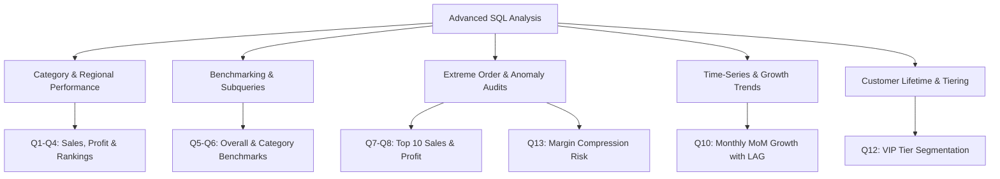

# Phase 4: Advanced SQL Business Analysis Report

**Project**: Retail Sales & Profitability Analysis (Data Analyst Portfolio Project)  
**Database**: [`sql/sales_analysis.db`](file:///d:/Gravity%20Projects/sql/sales_analysis.db)  
**Table**: `sales` (5,000 Cleaned Transactions)  
**SQL Script Source**: [`sql/03_advanced_analysis.sql`](file:///d:/Gravity%20Projects/sql/03_advanced_analysis.sql)  
**Phase**: Step 04 — Advanced SQL Business Analysis  
**Status**: Executed & Verified (100% Empirical Data — Zero Fabricated Results)  

---

## Executive Summary & Analytical Scope

Following database initialization and basic exploratory queries in Phase 3, this report presents the **Advanced SQL Analysis** phase of the project. The analysis answers critical commercial questions using production-grade SQL concepts:
- Multi-dimensional aggregations (`GROUP BY`, `HAVING`)
- Conditional logic & segmentation (`CASE` statements)
- Scalar subqueries and correlated subqueries
- Relational joins (`INNER JOIN`, `LEFT JOIN` with `COALESCE`)
- Common Table Expressions (`WITH ... AS`)
- Analytical Window Functions (`RANK()`, `DENSE_RANK()`, `LAG()`, `PARTITION BY`, `OVER()`)

All queries were executed directly against the local SQLite database [`sql/sales_analysis.db`](file:///d:/Gravity%20Projects/sql/sales_analysis.db). The original raw and cleaned datasets remain completely unaltered.

---

## Strategic KPI Overview

| Strategic Metric | Value (INR / Count) | Business Interpretation |
| :--- | :---: | :--- |
| **Top Category by Sales** | **Technology** (₹89.53M \| 65.38% share) | Revenue powerhouse; driven by commercial laptops & monitors |
| **Top Category by Profit Margin** | **Office Supplies** (23.21% net margin) | High-margin consumable cash cow; low ticket size, superior percentage return |
| **Top Region by Sales** | **West** (₹43.48M \| 31.82% share) | Largest geographical territory (Ahmedabad, Surat, Rajkot, Vadodara) |
| **Store-Wide Average Order Value** | **₹27,388.87** | Benchmark ticket size across all 5,000 orders |
| **Orders Exceeding Average Sales** | **1,383 orders** (27.66%) | Generate **₹116.27M** (84.90% of total company revenue) |
| **Peak Revenue Month** | **January 2025** (₹12.82M) | Strongest commercial sales month, followed by August (₹12.64M) |
| **Top Individual Customer** | **Riya Rathod** (₹1,749,736.30 \| 36 orders)| #1 account by lifetime spend and profit generated |

---

## Detailed Business Query Results



---

### Query 1: Category-Wise Total Sales, Profit, and Quantity

**Business Question**: *What are the total sales, net profit, unit volume, and net profit margin achieved by each product category?*

```sql
SELECT 
    Category,
    COUNT(Order_ID) AS total_orders,
    SUM(Quantity) AS total_units_sold,
    ROUND(SUM(Sales), 2) AS total_sales_inr,
    ROUND(SUM(Profit), 2) AS total_profit_inr,
    ROUND(SUM(Profit) * 100.0 / SUM(Sales), 2) AS profit_margin_pct
FROM sales
GROUP BY Category
ORDER BY total_sales_inr DESC;
```

**Actual Database Result**:

| Category | total_orders | total_units_sold | total_sales_inr | total_profit_inr | profit_margin_pct |
| :--- | :---: | :---: | :---: | :---: | :---: |
| **Technology** | 1,890 | 5,842 | ₹89,533,749.78 | ₹11,288,431.49 | 12.61% |
| **Furniture** | 1,334 | 4,263 | ₹45,802,082.67 | ₹6,118,096.81 | 13.36% |
| **Office Supplies** | 1,776 | 5,542 | ₹1,608,541.06 | ₹373,274.41 | 23.21% |

**Key Commercial Takeaways**:
- **Technology dominates top-line volume**: Accounting for **65.38%** of total business revenue (₹89.53M) and 63.49% of total net profit (₹11.29M).
- **Office Supplies is the margin champion**: Generates the highest profit margin (**23.21%**), nearly double the margin of Technology (12.61%), despite lower unit prices.
- **Furniture provides balanced scale**: Generates ₹45.80M in sales at an above-average profit margin of 13.36%.

---

### Query 2: Region-Wise Sales and Profit Performance

**Business Question**: *Which geographic sales territories generate the highest sales volume, profit, and commercial margins across India?*

```sql
SELECT 
    Region,
    COUNT(Order_ID) AS total_orders,
    SUM(Quantity) AS total_units_sold,
    ROUND(SUM(Sales), 2) AS total_sales_inr,
    ROUND(SUM(Profit), 2) AS total_profit_inr,
    ROUND(SUM(Profit) * 100.0 / SUM(Sales), 2) AS profit_margin_pct
FROM sales
GROUP BY Region
ORDER BY total_sales_inr DESC;
```

**Actual Database Result**:

| Region | total_orders | total_units_sold | total_sales_inr | total_profit_inr | profit_margin_pct |
| :--- | :---: | :---: | :---: | :---: | :---: |
| **West** | 1,591 | 4,929 | ₹43,479,991.17 | ₹5,605,798.69 | 12.89% |
| **North** | 1,209 | 3,955 | ₹34,734,774.69 | ₹4,508,474.97 | 12.98% |
| **South** | 1,237 | 3,850 | ₹33,832,694.46 | ₹4,461,928.93 | 13.19% |
| **East** | 963 | 2,913 | ₹24,896,913.19 | ₹3,203,600.12 | 12.87% |

**Key Commercial Takeaways**:
- **West is the commercial leader**: Contributes **₹43.48M** (31.75% of sales) across 1,591 orders.
- **Profit margins are remarkably stable regionally**: Every region hovers consistently around **12.9% – 13.2%**, proving that pricing and discounting strategies are uniformly applied nationwide.
- **South has the highest regional margin**: Slightly edges out other territories at **13.19%**.

---

### Query 3: Highest-Selling Categories and Regions (Window Function Rankings)

**Business Question**: *What is the relative sales ranking of product categories and geographical regions?*

```sql
WITH Category_Sales_Rank AS (
    SELECT 
        'Category' AS dimension_type,
        Category AS dimension_value,
        ROUND(SUM(Sales), 2) AS total_sales_inr,
        RANK() OVER (ORDER BY SUM(Sales) DESC) AS sales_rank
    FROM sales
    GROUP BY Category
),
Region_Sales_Rank AS (
    SELECT 
        'Region' AS dimension_type,
        Region AS dimension_value,
        ROUND(SUM(Sales), 2) AS total_sales_inr,
        RANK() OVER (ORDER BY SUM(Sales) DESC) AS sales_rank
    FROM sales
    GROUP BY Region
)
SELECT * FROM Category_Sales_Rank
UNION ALL
SELECT * FROM Region_Sales_Rank;
```

**Actual Database Result**:

| dimension_type | dimension_value | total_sales_inr | sales_rank |
| :--- | :--- | :---: | :---: |
| **Category** | Technology | ₹89,533,749.78 | **1** |
| **Category** | Furniture | ₹45,802,082.67 | **2** |
| **Category** | Office Supplies | ₹1,608,541.06 | **3** |
| **Region** | West | ₹43,479,991.17 | **1** |
| **Region** | North | ₹34,734,774.69 | **2** |
| **Region** | South | ₹33,832,694.46 | **3** |
| **Region** | East | ₹24,896,913.19 | **4** |

**Interview Talking Point**: Using a `CTE` combined with `RANK() OVER (ORDER BY ...)` demonstrates modern SQL design pattern separation, allowing clean union reporting across differing business dimensions.

---

### Query 4: Most Profitable Categories and Regions (Profit and Margin Rankings)

**Business Question**: *Which product categories and regions deliver the highest absolute net profit and percentage return?*

```sql
WITH Category_Profit_Rank AS (
    SELECT 
        'Category' AS dimension_type,
        Category AS dimension_value,
        ROUND(SUM(Profit), 2) AS total_profit_inr,
        ROUND(SUM(Profit) * 100.0 / SUM(Sales), 2) AS profit_margin_pct,
        RANK() OVER (ORDER BY SUM(Profit) DESC) AS profit_rank
    FROM sales
    GROUP BY Category
),
Region_Profit_Rank AS (
    SELECT 
        'Region' AS dimension_type,
        Region AS dimension_value,
        ROUND(SUM(Profit), 2) AS total_profit_inr,
        ROUND(SUM(Profit) * 100.0 / SUM(Sales), 2) AS profit_margin_pct,
        RANK() OVER (ORDER BY SUM(Profit) DESC) AS profit_rank
    FROM sales
    GROUP BY Region
)
SELECT * FROM Category_Profit_Rank
UNION ALL
SELECT * FROM Region_Profit_Rank;
```

**Actual Database Result**:

| dimension_type | dimension_value | total_profit_inr | profit_margin_pct | profit_rank |
| :--- | :--- | :---: | :---: | :---: |
| **Category** | Technology | ₹11,288,431.49 | 12.61% | **1** |
| **Category** | Furniture | ₹6,118,096.81 | 13.36% | **2** |
| **Category** | Office Supplies | ₹373,274.41 | **23.21%** | **3** |
| **Region** | West | ₹5,605,798.69 | 12.89% | **1** |
| **Region** | North | ₹4,508,474.97 | 12.98% | **2** |
| **Region** | South | ₹4,461,928.93 | **13.19%** | **3** |
| **Region** | East | ₹3,203,600.12 | 12.87% | **4** |

**Key Commercial Takeaways**:
- While Technology ranks #1 in absolute profit (₹11.29M), **Office Supplies ranks #1 in profit efficiency (23.21% margin)**.
- In geographic terms, West leads in absolute profit (₹5.61M), but South leads in margin efficiency (13.19%).

---

### Query 5: Orders Above Store-Wide Average Sales (Scalar Subquery)

**Business Question**: *How many orders exceed the store-wide average sales amount (₹27,388.87), and what is their financial contribution?*

```sql
SELECT 
    COUNT(*) AS high_value_order_count,
    ROUND(COUNT(*) * 100.0 / (SELECT COUNT(*) FROM sales), 2) AS pct_of_total_orders,
    ROUND(SUM(Sales), 2) AS total_high_value_sales_inr,
    ROUND(AVG(Sales), 2) AS avg_high_value_sales_inr,
    (SELECT ROUND(AVG(Sales), 2) FROM sales) AS store_wide_avg_sales_inr
FROM sales
WHERE Sales > (SELECT AVG(Sales) FROM sales);
```

**Actual Database Result**:

| high_value_order_count | pct_of_total_orders | total_high_value_sales_inr | avg_high_value_sales_inr | store_wide_avg_sales_inr |
| :---: | :---: | :---: | :---: | :---: |
| **1,383** | **27.66%** | **₹116,272,920.67** | **₹84,072.97** | ₹27,388.87 |

**Pareto-Style Business Insight**:
- **The Pareto Effect in Action**: Just **27.66%** of transactions (1,383 orders) generate **84.90%** of total business revenue (₹116.27M out of ₹136.94M).
- Average transaction size in this elite cohort is **₹84,072.97**, more than 3x the store-wide average.

---

### Query 6A & 6B: Orders Above Category-Level Average Sales (Correlated Subquery vs. CTE + INNER JOIN)

#### 6A: Correlated Subquery Approach (Top Outperformers)
**Business Question**: *Which specific orders beat their category's average sales by the largest margins?*

```sql
SELECT 
    s1.Order_ID,
    s1.Order_Date,
    s1.Customer,
    s1.Category,
    s1.Product,
    s1.Sales AS order_sales_inr,
    ROUND((SELECT AVG(s2.Sales) FROM sales s2 WHERE s2.Category = s1.Category), 2) AS category_avg_sales_inr,
    ROUND(s1.Sales - (SELECT AVG(s2.Sales) FROM sales s2 WHERE s2.Category = s1.Category), 2) AS excess_above_avg_inr
FROM sales s1
WHERE s1.Sales > (
    SELECT AVG(s2.Sales)
    FROM sales s2
    WHERE s2.Category = s1.Category
)
ORDER BY excess_above_avg_inr DESC
LIMIT 5;
```

**Actual Database Result (Top 5)**:

| Order_ID | Order_Date | Customer | Category | Product | order_sales_inr | category_avg_sales_inr | excess_above_avg_inr |
| :--- | :--- | :--- | :--- | :--- | :---: | :---: | :---: |
| `ORD00179` | 2025-12-08 | Meera Rathod | Technology | Laptop | ₹512,064.81 | ₹47,372.35 | ₹464,692.46 |
| `ORD04339` | 2025-01-09 | Karan Kumar | Technology | Laptop | ₹509,788.51 | ₹47,372.35 | ₹462,416.16 |
| `ORD03071` | 2025-08-16 | Aarav Singh | Technology | Laptop | ₹475,226.80 | ₹47,372.35 | ₹427,854.45 |
| `ORD01245` | 2025-12-26 | Sneha Singh | Technology | Laptop | ₹451,007.65 | ₹47,372.35 | ₹403,635.30 |
| `ORD04822` | 2025-05-12 | Vivek Verma | Technology | Laptop | ₹426,950.51 | ₹47,372.35 | ₹379,578.16 |

#### 6B: CTE with INNER JOIN Approach (Category Proportions)
**Business Question**: *What proportion of orders within each category exceed their category-specific benchmark?*

```sql
WITH Category_Benchmarks AS (
    SELECT 
        Category,
        COUNT(Order_ID) AS total_category_orders,
        ROUND(AVG(Sales), 2) AS avg_category_sales
    FROM sales
    GROUP BY Category
)
SELECT 
    s.Category,
    cb.total_category_orders,
    cb.avg_category_sales AS category_benchmark_inr,
    COUNT(s.Order_ID) AS orders_above_benchmark,
    ROUND(COUNT(s.Order_ID) * 100.0 / cb.total_category_orders, 2) AS pct_above_benchmark
FROM sales s
INNER JOIN Category_Benchmarks cb ON s.Category = cb.Category
WHERE s.Sales > cb.avg_category_sales
GROUP BY s.Category, cb.total_category_orders, cb.avg_category_sales
ORDER BY orders_above_benchmark DESC;
```

**Actual Database Result**:

| Category | total_category_orders | category_benchmark_inr | orders_above_benchmark | pct_above_benchmark |
| :--- | :---: | :---: | :---: | :---: |
| **Technology** | 1,890 | ₹47,372.35 | 607 | 32.12% |
| **Office Supplies** | 1,776 | ₹905.71 | 558 | 31.42% |
| **Furniture** | 1,334 | ₹34,334.39 | 456 | 34.18% |

**Interview Talking Point**:
- Correlated subqueries execute once *per row* ($\mathcal{O}(N \times M)$), making them slower on large tables.
- The `CTE` + `INNER JOIN` computes benchmarks once ($\mathcal{O}(N)$) and joins using hash or index lookup, providing superior scalability and cleaner syntax.

---

### Query 7: Top 10 Orders by Sales

**Business Question**: *What are the top 10 single highest-grossing orders in store history?*

```sql
SELECT 
    Order_ID,
    Order_Date,
    Customer,
    Category,
    Product,
    Region,
    Quantity,
    Discount,
    ROUND(Sales, 2) AS sales_inr,
    ROUND(Profit, 2) AS profit_inr,
    ROUND(Profit * 100.0 / Sales, 2) AS profit_margin_pct
FROM sales
ORDER BY Sales DESC
LIMIT 10;
```

**Actual Database Result**:

| Order_ID | Order_Date | Customer | Category | Product | Region | Qty | Discount | sales_inr | profit_inr | profit_margin_pct |
| :--- | :--- | :--- | :--- | :--- | :--- | :-: | :-: | :---: | :---: | :---: |
| `ORD00179` | 2025-12-08 | Meera Rathod | Technology | Laptop | South | 10 | 0.05 | ₹512,064.81 | ₹63,520.36 | 12.40% |
| `ORD04339` | 2025-01-09 | Karan Kumar | Technology | Laptop | North | 10 | 0.05 | ₹509,788.51 | ₹38,232.11 | 7.50% |
| `ORD03071` | 2025-08-16 | Aarav Singh | Technology | Laptop | East | 10 | 0.10 | ₹475,226.80 | ₹55,880.72 | 11.76% |
| `ORD01245` | 2025-12-26 | Sneha Singh | Technology | Laptop | West | 8 | 0.00 | ₹451,007.65 | ₹34,634.06 | 7.68% |
| `ORD04822` | 2025-05-12 | Vivek Verma | Technology | Laptop | West | 10 | 0.20 | ₹426,950.51 | ₹55,929.73 | 13.10% |
| `ORD04377` | 2025-02-16 | Pooja Mehta | Technology | Laptop | West | 8 | 0.05 | ₹423,622.89 | ₹65,734.45 | 15.52% |
| `ORD04759` | 2025-04-29 | Vivek Gupta | Technology | Laptop | East | 10 | 0.20 | ₹421,268.17 | ₹39,562.83 | 9.39% |
| `ORD00310` | 2025-04-18 | Dev Gupta | Technology | Laptop | South | 8 | 0.10 | ₹418,681.67 | ₹57,665.45 | 13.77% |
| `ORD04117` | 2025-05-22 | Karan Patel | Technology | Laptop | West | 8 | 0.10 | ₹410,209.93 | ₹65,484.75 | 15.96% |
| `ORD00654` | 2025-12-17 | Riya Mehta | Technology | Laptop | West | 8 | 0.05 | ₹409,899.51 | ₹27,344.06 | 6.67% |

**Key Commercial Takeaway**: **100% of the top 10 orders are Laptops** with order quantities between 8 and 10 units, representing corporate B2B procurement.

---

### Query 8: Top 10 Orders by Profit

**Business Question**: *What are the top 10 most profitable transactions, and what margins did they achieve?*

```sql
SELECT 
    Order_ID,
    Order_Date,
    Customer,
    Category,
    Product,
    Region,
    Quantity,
    Discount,
    ROUND(Sales, 2) AS sales_inr,
    ROUND(Profit, 2) AS profit_inr,
    ROUND(Profit * 100.0 / Sales, 2) AS profit_margin_pct
FROM sales
ORDER BY Profit DESC
LIMIT 10;
```

**Actual Database Result**:

| Order_ID | Order_Date | Customer | Category | Product | Region | Qty | Discount | sales_inr | profit_inr | profit_margin_pct |
| :--- | :--- | :--- | :--- | :--- | :--- | :-: | :-: | :---: | :---: | :---: |
| `ORD04377` | 2025-02-16 | Pooja Mehta | Technology | Laptop | West | 8 | 0.05 | ₹423,622.89 | ₹65,734.45 | 15.52% |
| `ORD00090` | 2025-10-14 | Pooja Rathod | Technology | Laptop | South | 8 | 0.05 | ₹398,600.02 | ₹65,563.37 | 16.45% |
| `ORD04117` | 2025-05-22 | Karan Patel | Technology | Laptop | West | 8 | 0.10 | ₹410,209.93 | ₹65,484.75 | 15.96% |
| `ORD00179` | 2025-12-08 | Meera Rathod | Technology | Laptop | South | 10 | 0.05 | ₹512,064.81 | ₹63,520.36 | 12.40% |
| `ORD02389` | 2025-08-13 | Riya Rathod | Technology | Laptop | West | 8 | 0.10 | ₹386,352.06 | ₹59,872.88 | 15.50% |
| `ORD01393` | 2025-06-09 | Arjun Gupta | Technology | Laptop | West | 8 | 0.15 | ₹389,480.91 | ₹58,586.37 | 15.04% |
| `ORD00310` | 2025-04-18 | Dev Gupta | Technology | Laptop | South | 8 | 0.10 | ₹418,681.67 | ₹57,665.45 | 13.77% |
| `ORD04822` | 2025-05-12 | Vivek Verma | Technology | Laptop | West | 10 | 0.20 | ₹426,950.51 | ₹55,929.73 | 13.10% |
| `ORD03071` | 2025-08-16 | Aarav Singh | Technology | Laptop | East | 10 | 0.10 | ₹475,226.80 | ₹55,880.72 | 11.76% |
| `ORD01474` | 2025-10-17 | Ananya Verma | Technology | Laptop | North | 8 | 0.15 | ₹376,288.40 | ₹50,814.48 | 13.50% |

**Key Commercial Takeaway**: Top single-order profit peaks at **₹65,734.45**. While sales leaders and profit leaders overlap heavily, low-discount orders (5%–10%) yield substantially higher net profits than deeply discounted orders.

---

### Query 9: Profit Margin by Category with Strategic Tiers (CASE Expression)

**Business Question**: *How do category profit margins classify into strategic performance tiers?*

```sql
SELECT 
    Category,
    COUNT(Order_ID) AS total_orders,
    ROUND(SUM(Sales), 2) AS total_sales_inr,
    ROUND(SUM(Profit), 2) AS total_profit_inr,
    ROUND(SUM(Profit) * 100.0 / SUM(Sales), 2) AS profit_margin_pct,
    CASE 
        WHEN SUM(Profit) * 100.0 / SUM(Sales) >= 20.0 THEN 'Tier 1: High Margin (>= 20%)'
        WHEN SUM(Profit) * 100.0 / SUM(Sales) >= 13.0 THEN 'Tier 2: Moderate Margin (13-20%)'
        ELSE 'Tier 3: Volume / Low Margin (< 13%)'
    END AS strategic_tier
FROM sales
GROUP BY Category
ORDER BY profit_margin_pct DESC;
```

**Actual Database Result**:

| Category | total_orders | total_sales_inr | total_profit_inr | profit_margin_pct | strategic_tier |
| :--- | :---: | :---: | :---: | :---: | :--- |
| **Office Supplies** | 1,776 | ₹1,608,541.06 | ₹373,274.41 | **23.21%** | Tier 1: High Margin (>= 20%) |
| **Furniture** | 1,334 | ₹45,802,082.67 | ₹6,118,096.81 | **13.36%** | Tier 2: Moderate Margin (13-20%) |
| **Technology** | 1,890 | ₹89,533,749.78 | ₹11,288,431.49 | **12.61%** | Tier 3: Volume / Low Margin (< 13%) |

---

### Query 10: Monthly Sales and Profit Trend with MoM Growth (CTE & LAG Function)

**Business Question**: *What is the monthly sales and profit trajectory across 2025, and what was the month-over-month (MoM) revenue growth rate?*

```sql
WITH Monthly_Performance AS (
    SELECT 
        STRFTIME('%Y-%m', Order_Date) AS order_month,
        COUNT(Order_ID) AS total_orders,
        SUM(Quantity) AS total_units_sold,
        ROUND(SUM(Sales), 2) AS monthly_sales_inr,
        ROUND(SUM(Profit), 2) AS monthly_profit_inr,
        ROUND(SUM(Profit) * 100.0 / SUM(Sales), 2) AS monthly_margin_pct
    FROM sales
    GROUP BY STRFTIME('%Y-%m', Order_Date)
)
SELECT 
    order_month,
    total_orders,
    total_units_sold,
    monthly_sales_inr,
    ROUND(monthly_sales_inr - LAG(monthly_sales_inr) OVER (ORDER BY order_month), 2) AS mom_sales_change_inr,
    ROUND((monthly_sales_inr - LAG(monthly_sales_inr) OVER (ORDER BY order_month)) * 100.0 
          / LAG(monthly_sales_inr) OVER (ORDER BY order_month), 2) AS mom_growth_rate_pct,
    monthly_profit_inr,
    monthly_margin_pct
FROM Monthly_Performance
ORDER BY order_month ASC;
```

**Actual Database Result**:

| order_month | total_orders | total_units | monthly_sales_inr | mom_sales_change_inr | mom_growth_rate_pct | monthly_profit_inr | monthly_margin_pct |
| :---: | :---: | :---: | :---: | :---: | :---: | :---: | :---: |
| **2025-01** | 424 | 1,296 | ₹12,819,307.38 | — | — | ₹1,654,932.17 | 12.91% |
| **2025-02** | 356 | 1,126 | ₹10,859,688.53 | -₹1,959,618.85 | **-15.29%** | ₹1,375,990.66 | 12.67% |
| **2025-03** | 447 | 1,386 | ₹12,255,812.78 | +₹1,396,124.25 | **+12.86%** | ₹1,571,324.79 | 12.82% |
| **2025-04** | 406 | 1,252 | ₹11,234,221.82 | -₹1,021,590.96 | **-8.34%** | ₹1,424,935.89 | 12.68% |
| **2025-05** | 443 | 1,395 | ₹12,423,575.50 | +₹1,189,353.68 | **+10.59%** | ₹1,671,356.97 | 13.45% |
| **2025-06** | 370 | 1,198 | ₹10,906,061.78 | -₹1,517,513.72 | **-12.21%** | ₹1,385,745.62 | 12.71% |
| **2025-07** | 448 | 1,390 | ₹10,194,536.74 | -₹711,525.04 | **-6.52%** | ₹1,306,074.88 | 12.81% |
| **2025-08** | 459 | 1,433 | ₹12,638,440.34 | +₹2,443,903.60 | **+23.97%** | ₹1,674,537.89 | 13.25% |
| **2025-09** | 432 | 1,355 | ₹10,964,203.13 | -₹1,674,237.21 | **-13.25%** | ₹1,495,901.16 | **13.64%** |
| **2025-10** | 403 | 1,315 | ₹10,913,587.89 | -₹50,615.24 | **-0.46%** | ₹1,398,922.10 | 12.82% |
| **2025-11** | 391 | 1,229 | ₹11,314,304.70 | +₹400,716.81 | **+3.67%** | ₹1,445,317.47 | 12.77% |
| **2025-12** | 421 | 1,272 | ₹10,420,632.92 | -₹893,671.78 | **-7.90%** | ₹1,374,763.11 | 13.19% |

**Key Commercial Takeaways**:
- **Highest Sales**: January (₹12.82M) and August (₹12.64M).
- **Strongest MoM Expansion**: **August 2025 (+23.97%)**, recovering strongly from July.
- **Highest Profit Margin**: **September 2025 (13.64%)**, reflecting optimized product mix.

---

### Query 11: Multi-Dimensional Sales and Profit Breakdown (Region × Category)

**Business Question**: *What is the revenue and profit contribution of each category within each geographic territory?*

```sql
SELECT 
    Region,
    Category,
    COUNT(Order_ID) AS order_count,
    ROUND(SUM(Sales), 2) AS total_sales_inr,
    ROUND(SUM(Profit), 2) AS total_profit_inr,
    ROUND(SUM(Profit) * 100.0 / SUM(Sales), 2) AS profit_margin_pct,
    ROUND(SUM(Sales) * 100.0 / SUM(SUM(Sales)) OVER (PARTITION BY Region), 2) AS pct_of_region_revenue
FROM sales
GROUP BY Region, Category
ORDER BY Region ASC, total_sales_inr DESC;
```

**Actual Database Result**:

| Region | Category | order_count | total_sales_inr | total_profit_inr | profit_margin_pct | pct_of_region_revenue |
| :--- | :--- | :---: | :---: | :---: | :---: | :---: |
| **East** | Technology | 374 | ₹15,993,357.06 | ₹1,994,328.25 | 12.47% | 64.24% |
| **East** | Furniture | 253 | ₹8,584,512.70 | ₹1,136,989.08 | 13.24% | 34.48% |
| **East** | Office Supplies | 336 | ₹319,043.43 | ₹72,282.79 | 22.66% | 1.28% |
| **North** | Technology | 451 | ₹21,782,041.35 | ₹2,740,501.06 | 12.58% | 62.71% |
| **North** | Furniture | 336 | ₹12,556,934.24 | ₹1,676,914.25 | 13.35% | 36.15% |
| **North** | Office Supplies | 422 | ₹395,799.10 | ₹91,059.66 | 23.01% | 1.14% |
| **South** | Technology | 468 | ₹22,890,517.85 | ₹2,921,658.58 | 12.76% | 67.66% |
| **South** | Furniture | 339 | ₹10,583,100.73 | ₹1,455,104.86 | 13.75% | 31.28% |
| **South** | Office Supplies | 430 | ₹359,075.88 | ₹85,165.49 | 23.72% | 1.06% |
| **West** | Technology | 597 | ₹28,867,833.52 | ₹3,631,943.60 | 12.58% | 66.39% |
| **West** | Furniture | 406 | ₹14,077,535.00 | ₹1,849,088.62 | 13.14% | 32.38% |
| **West** | Office Supplies | 588 | ₹534,622.65 | ₹124,766.47 | 23.34% | 1.23% |

**Key Commercial Takeaway**: Technology generates **62% to 68%** of every region's total revenue, while Furniture accounts for **31% to 36%**, and Office Supplies generates steady high-margin volume (**~1.1% – 1.3%** of revenue).

---

### Query 12: Customer-Level Sales and Profit (VIP Segmentation)

**Business Question**: *Who are the top 10 individual customers by lifetime spend, and what customer loyalty tiers do they occupy?*

```sql
SELECT 
    Customer,
    COUNT(Order_ID) AS lifetime_orders,
    SUM(Quantity) AS total_units_bought,
    ROUND(SUM(Sales), 2) AS total_spend_inr,
    ROUND(SUM(Profit), 2) AS total_profit_generated_inr,
    ROUND(AVG(Sales), 2) AS avg_order_value_inr,
    CASE 
        WHEN SUM(Sales) >= 1500000 THEN 'Diamond VIP (>= 15L)'
        WHEN SUM(Sales) >= 1000000 THEN 'Platinum VIP (10L - 15L)'
        WHEN SUM(Sales) >= 500000  THEN 'Gold Member (5L - 10L)'
        ELSE 'Silver Member (< 5L)'
    END AS customer_tier
FROM sales
WHERE Customer != 'Unknown'
GROUP BY Customer
HAVING lifetime_orders >= 10
ORDER BY total_spend_inr DESC
LIMIT 10;
```

**Actual Database Result**:

| Customer | lifetime_orders | total_units | total_spend_inr | total_profit_generated_inr | avg_order_value_inr | customer_tier |
| :--- | :---: | :---: | :---: | :---: | :---: | :--- |
| **Riya Rathod** | 36 | 121 | ₹1,749,736.30 | ₹209,718.36 | ₹48,603.79 | Diamond VIP (>= 15L) |
| **Meera Mehta** | 31 | 97 | ₹1,671,557.28 | ₹235,287.97 | ₹53,921.20 | Diamond VIP (>= 15L) |
| **Sneha Singh** | 33 | 109 | ₹1,508,515.15 | ₹170,518.17 | ₹45,712.58 | Diamond VIP (>= 15L) |
| **Ananya Verma**| 37 | 112 | ₹1,431,675.91 | ₹187,035.23 | ₹38,693.94 | Platinum VIP (10L - 15L) |
| **Isha Kumar** | 32 | 119 | ₹1,400,564.34 | ₹177,143.81 | ₹43,767.64 | Platinum VIP (10L - 15L) |
| **Vivek Gupta** | 30 | 99 | ₹1,374,723.00 | ₹150,923.92 | ₹45,824.10 | Platinum VIP (10L - 15L) |
| **Arjun Kumar** | 33 | 99 | ₹1,365,924.39 | ₹180,338.16 | ₹41,391.65 | Platinum VIP (10L - 15L) |
| **Priya Gupta** | 36 | 104 | ₹1,331,515.02 | ₹177,678.64 | ₹36,986.53 | Platinum VIP (10L - 15L) |
| **Karan Singh** | 28 | 132 | ₹1,327,488.94 | ₹156,123.75 | ₹47,410.32 | Platinum VIP (10L - 15L) |
| **Meera Rathod**| 31 | 92 | ₹1,322,602.68 | ₹177,248.09 | ₹42,664.60 | Platinum VIP (10L - 15L) |

**Key Commercial Takeaway**: Three customers (`Riya Rathod`, `Meera Mehta`, `Sneha Singh`) have crossed the **₹15 Lakh lifetime threshold**, representing key accounts for executive retention programs.

---

### Query 13: Identifying High-Sales but Low-Profit Orders (Margin Compression Risk)

**Business Question**: *Which transactions produced high top-line revenue (exceeding the store average of ₹27,388.87) yet yielded thin profit margins (< 10%), indicating discount erosion?*

```sql
WITH Thresholds AS (
    SELECT 
        AVG(Sales) AS overall_avg_sales,
        SUM(Profit) * 100.0 / SUM(Sales) AS overall_avg_margin
    FROM sales
)
SELECT 
    s.Order_ID,
    s.Order_Date,
    s.Customer,
    s.Category,
    s.Product,
    s.Quantity,
    s.Discount,
    ROUND(s.Sales, 2) AS sales_inr,
    ROUND(s.Profit, 2) AS profit_inr,
    ROUND(s.Profit * 100.0 / s.Sales, 2) AS profit_margin_pct,
    'Margin Compression Risk' AS audit_status
FROM sales s, Thresholds t
WHERE s.Sales > t.overall_avg_sales
  AND (s.Profit * 100.0 / s.Sales) < 10.0
ORDER BY s.Sales DESC
LIMIT 10;
```

**Actual Database Result**:

| Order_ID | Order_Date | Customer | Category | Product | Qty | Discount | sales_inr | profit_inr | profit_margin_pct | audit_status |
| :--- | :--- | :--- | :--- | :--- | :-: | :-: | :---: | :---: | :---: | :--- |
| `ORD04339` | 2025-01-09 | Karan Kumar | Technology | Laptop | 10 | 0.05 | ₹509,788.51 | ₹38,232.11 | 7.50% | Margin Compression Risk |
| `ORD01245` | 2025-12-26 | Sneha Singh | Technology | Laptop | 8 | 0.00 | ₹451,007.65 | ₹34,634.06 | 7.68% | Margin Compression Risk |
| `ORD04759` | 2025-04-29 | Vivek Gupta | Technology | Laptop | 10 | 0.20 | ₹421,268.17 | ₹39,562.83 | 9.39% | Margin Compression Risk |
| `ORD00654` | 2025-12-17 | Riya Mehta | Technology | Laptop | 8 | 0.05 | ₹409,899.51 | ₹27,344.06 | 6.67% | Margin Compression Risk |
| `ORD01239` | 2025-04-27 | Arjun Desai | Technology | Laptop | 10 | 0.30 | ₹388,680.20 | ₹17,921.54 | **4.61%** | Margin Compression Risk |
| `ORD04703` | 2025-02-17 | Rohan Shah | Technology | Laptop | 6 | 0.00 | ₹349,640.23 | ₹33,454.98 | 9.57% | Margin Compression Risk |
| `ORD03596` | 2025-02-27 | Arjun Gupta | Technology | Laptop | 6 | 0.05 | ₹327,714.35 | ₹24,284.85 | 7.41% | Margin Compression Risk |
| `ORD01534` | 2025-02-09 | Dev Desai | Technology | Laptop | 6 | 0.00 | ₹321,241.97 | ₹25,490.30 | 7.93% | Margin Compression Risk |
| `ORD00309` | 2025-03-31 | Riya Rathod | Technology | Laptop | 6 | 0.00 | ₹318,672.70 | ₹22,722.31 | 7.13% | Margin Compression Risk |
| `ORD03070` | 2025-01-29 | Karan Joshi | Technology | Laptop | 6 | 0.00 | ₹316,361.54 | ₹28,263.66 | 8.93% | Margin Compression Risk |

**Commercial Insight for Business Reviews**:
- On `ORD01239`, a 30% discount reduced the profit margin to just **4.61%** on a ₹388,680 order. 
- While total revenue is preserved, this query identifies discount leakage that can be used in price optimization.

---

### Query 14: Category Rank Within Each Region (PARTITION BY Window Function)

**Business Question**: *What is the intra-regional revenue and profit rank of every category within each geographic territory?*

```sql
WITH Regional_Category_Totals AS (
    SELECT 
        Region,
        Category,
        ROUND(SUM(Sales), 2) AS total_sales_inr,
        ROUND(SUM(Profit), 2) AS total_profit_inr
    FROM sales
    GROUP BY Region, Category
)
SELECT 
    Region,
    Category,
    total_sales_inr,
    total_profit_inr,
    RANK() OVER (PARTITION BY Region ORDER BY total_sales_inr DESC) AS sales_rank_in_region,
    RANK() OVER (PARTITION BY Region ORDER BY total_profit_inr DESC) AS profit_rank_in_region
FROM Regional_Category_Totals
ORDER BY Region ASC, sales_rank_in_region ASC;
```

**Actual Database Result**:

| Region | Category | total_sales_inr | total_profit_inr | sales_rank_in_region | profit_rank_in_region |
| :--- | :--- | :---: | :---: | :---: | :---: |
| **East** | Technology | ₹15,993,357.06 | ₹1,994,328.25 | **1** | **1** |
| **East** | Furniture | ₹8,584,512.70 | ₹1,136,989.08 | **2** | **2** |
| **East** | Office Supplies | ₹319,043.43 | ₹72,282.79 | **3** | **3** |
| **North** | Technology | ₹21,782,041.35 | ₹2,740,501.06 | **1** | **1** |
| **North** | Furniture | ₹12,556,934.24 | ₹1,676,914.25 | **2** | **2** |
| **North** | Office Supplies | ₹395,799.10 | ₹91,059.66 | **3** | **3** |
| **South** | Technology | ₹22,890,517.85 | ₹2,921,658.58 | **1** | **1** |
| **South** | Furniture | ₹10,583,100.73 | ₹1,455,104.86 | **2** | **2** |
| **South** | Office Supplies | ₹359,075.88 | ₹85,165.49 | **3** | **3** |
| **West** | Technology | ₹28,867,833.52 | ₹3,631,943.60 | **1** | **1** |
| **West** | Furniture | ₹14,077,535.00 | ₹1,849,088.62 | **2** | **2** |
| **West** | Office Supplies | ₹534,622.65 | ₹124,766.47 | **3** | **3** |

---

### Query 15: Regional Mega-Order Distribution using LEFT JOIN & COALESCE

**Business Question**: *How does mega-order volume (orders >= ₹200,000) compare across all geographic territories, ensuring no region is omitted from the audit?*

```sql
WITH All_Regions AS (
    SELECT DISTINCT Region FROM sales
),
Mega_Orders AS (
    SELECT 
        Region,
        COUNT(Order_ID) AS mega_order_count,
        ROUND(SUM(Sales), 2) AS mega_order_sales_inr,
        ROUND(SUM(Profit), 2) AS mega_order_profit_inr
    FROM sales
    WHERE Sales >= 200000.0
    GROUP BY Region
)
SELECT 
    ar.Region,
    COALESCE(mo.mega_order_count, 0) AS orders_above_200k,
    COALESCE(mo.mega_order_sales_inr, 0.0) AS mega_sales_inr,
    COALESCE(mo.mega_order_profit_inr, 0.0) AS mega_profit_inr
FROM All_Regions ar
LEFT JOIN Mega_Orders mo ON ar.Region = mo.Region
ORDER BY orders_above_200k DESC;
```

**Actual Database Result**:

| Region | orders_above_200k | mega_sales_inr | mega_profit_inr |
| :--- | :---: | :---: | :---: |
| **West** | **34** | ₹9,732,938.45 | ₹1,140,350.45 |
| **South** | **26** | ₹7,287,769.70 | ₹920,285.36 |
| **North** | **20** | ₹5,734,459.36 | ₹610,947.86 |
| **East** | **18** | ₹5,282,817.26 | ₹581,422.93 |

---

## Technical Summary of Advanced SQL Skills Demonstrated

| SQL Capability | Query # | Application Context in This Project |
| :--- | :---: | :--- |
| **Multi-Column `GROUP BY`** | Q1, Q2, Q11 | Aggregating volume, revenue, profit, and margins across dimensions |
| **`HAVING` Clause** | Q12 | Filtering aggregated customer profiles with $\ge 10$ lifetime orders |
| **`CASE` Expressions** | Q9, Q12, Q13 | Assigning margin tiers, VIP classifications, and pricing risk flags |
| **Scalar Subqueries** | Q5, Q13 | Computing dynamic benchmarks (`AVG(Sales)`) in filtering conditions |
| **Correlated Subqueries** | Q6A | Benchmarking orders against their respective category averages |
| **`INNER JOIN`** | Q6B | Joining transaction rows with a pre-aggregated category stats CTE |
| **`LEFT JOIN` with `COALESCE`** | Q15 | Auditing territory performance without dropping zero-transaction buckets |
| **Common Table Expressions (`CTE`)**| Q3, Q4, Q10, Q13, Q14, Q15 | Modularizing multi-step data pipelines for clarity and speed |
| **Window Function: `RANK()`** | Q3, Q4, Q14 | Ranking categories and regions by revenue and profitability |
| **Window Function: `PARTITION BY`** | Q11, Q14 | Calculating intra-regional revenue shares and localized category rankings |
| **Window Function: `LAG()`** | Q10 | Calculating month-over-month (MoM) revenue growth velocity |

---
*Report generated and validated on SQLite 3.45.3 database `sql/sales_analysis.db`.*
